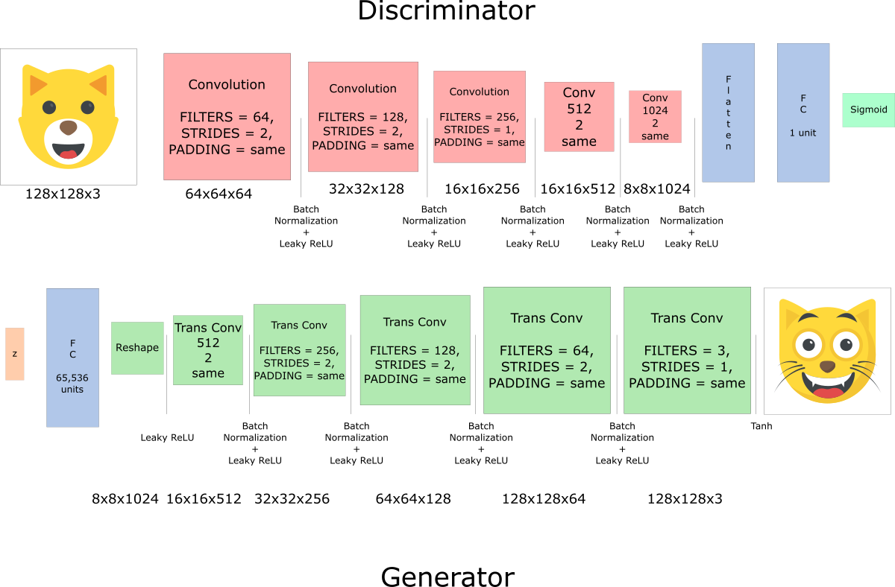

# CatDCGAN 🐱‍💻
A DGAN that generate Cat pictures
 

 Cat DCGAN is a Deep Convolutional Generative Adversarial Network (DCGAN) <b>that generates pictures of cats</b> 

This is an open source project 
 

## The tutorial 📃
If you want to implement it by yourself and understand how it works, <b>please read my article on FreeCodeCamp</b>  https://medium.freecodecamp.org/how-ai-can-learn-to-generate-pictures-of-cats-ba692cb6eae4

 

## Links 🔗
🌐 : https://simoninithomas.github.io/CatDCGAN/
  

 If you have any questions, <b> feel free to ask me: </b> 

 📧: <a href="mailto:hello@simoninithomas.com">hello@simoninithomas.com</a>  

 Github: https://github.com/simoninithomas/CatDCGAN 

 🌐 : https://www.simoninithomas.com 

 Twitter: <a href="https://twitter.com/ThomasSimonini">@ThomasSimonini</a> 

In this part we're going to implement the DCGAN.
Our Architecture:  

## Getting Started 📝
- Download the dataset here: https://www.kaggle.com/crawford/cat-dataset
- <b> Download the model checkpoint </b> : https://drive.google.com/drive/folders/1zdZZ91fjOUiOsIdAQKZkUTATXzqy7hiz?usp=sharing
- Type `sh start.sh` it will handle extract, remove outliers, normalization and face centering
- Launch Jupyter Notebook `jupyter notebook --no-browser`
- Launch CatDCGAN
- Change `do_preprocess = True` ⚠️⚠️⚠️ important!
- <b> If you want to train from scratch </b>: change `from_checkpoint = False`
- <b> If you want to train from last model saved (you save 20 hours of training 🎉)</b> : change `from_checkpoint = True`

## Important note 🤔
<b> You can't run this on your computer </b> (except if you have GPUs or wait 10 years 😅), personally I train this DCGAN for 20 hours with Microsoft Azure and their Deep Learning Virtual Machine (they offer 170$)
https://azuremarketplace.microsoft.com/en-us/marketplace/apps/microsoft-ads.dsvm-deep-learning
 
⚠️ I don't have any business relations with them. I just loved their excellent customer service.

If you have some troubles to use follow the explainations of this excellent article here (without last the part fast.ai): https://medium.com/@manikantayadunanda/setting-up-deeplearning-machine-and-fast-ai-on-azure-a22eb6bd6429

## Contributing 🙌
If you want to contribute to the project, your help is very welcome. This is an open source project.

We currently working on improving our Generative adversarial network architecture. If you're motivated come join us and submit your pull requests.

## Acknowledgements 👏
This project was made possible thanks to:
- Udacity Face Generator Project 
- The start.sh and preprocess part (modified) made by Alexia Jolicoeur-Martineau https://ajolicoeur.wordpress.com/cats/
- Siraj's Raval PokeGan https://github.com/llSourcell/Pokemon_GAN
- The choice of learning rate by Alexia Jolicoeur-Martineau https://ajolicoeur.wordpress.com/cats/

 
 

